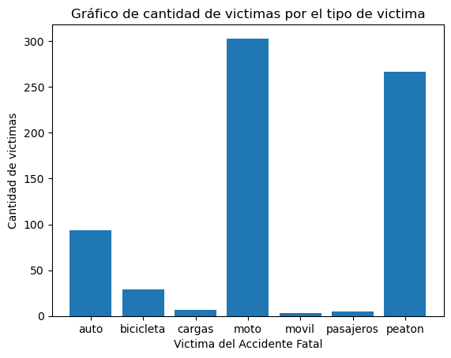

# 
PROYECTO DE DATA ANALIST DE SINIESTRO VIALES EN CABA

Ciudad Autónoma de Buenos Aires (CABA), siendo una de las áreas urbanas más grandes de Argentina, enfrenta desafíos significativos relacionados con la seguridad vial debido a la alta densidad de tráfico. Este entorno urbano congestionado y dinámico puede contribuir a una incidencia considerable de accidentes de tránsito.

## Recopilación y Análisis de Datos

Las autoridades locales suelen llevar a cabo la recopilación y el análisis de datos relacionados con accidentes de tráfico. Estos esfuerzos buscan comprender las tendencias, identificar áreas problemáticas y desarrollar estrategias de prevención efectivas. La información recopilada proporciona una base para la toma de decisiones informada y la implementación de medidas destinadas a mejorar la seguridad vial.

## Impacto Social y Económico

Los accidentes de tránsito no solo representan una amenaza para la seguridad de los ciudadanos, sino que también tienen un impacto significativo en la sociedad y la economía en general. Entre las consecuencias se incluyen pérdidas humanas, lesiones, costos médicos, daños a la propiedad y congestión del tráfico. Estos aspectos subrayan la importancia de abordar la seguridad vial de manera integral.

## Introducción

Con el objetivo de abordar la problemática de los accidentes de tránsito, se lleva a cabo un proyecto que incluye:

1. **Limpieza de Datos y Transformaciones:**
   - Se realiza una limpieza de la información recopilada y se aplican transformaciones necesarias para obtener datos claros y valiosos.

2. **Análisis Exploratorio de Datos:**
   - Se explora la información proporcionada por el gobierno de CABA para comprender la naturaleza y las características de los accidentes.

3. **Recomendaciones para la Seguridad Vial:**
   - Se ofrecen recomendaciones basadas en los hallazgos del análisis exploratorio y la información extraída.

4. **Key Performance Indicators (KPI):**
   - Se presentarán KPI que permitirán evaluar el cumplimiento de los objetivos de seguridad vial a lo largo del tiempo.

Este enfoque integral busca no solo entender la problemática de los accidentes de tránsito en CABA, sino también proponer soluciones efectivas y medir el progreso a través de indicadores clave a lo largo de los años.

## Limpieza de datos y transformaciones

Los datos de víctimas fatales en CABA fueron extraídos de **https://data.buenosaires.gob.ar/dataset/victimas-siniestros-viales**, la cual nos proporciona información desde el año 2012 hasta el 2021, incluyendo datos sobre las víctimas, edad, fecha del accidente, género, etc.

Estos datos fueron procesados en el archivo **01-ETL.ipynb**. En primer lugar, se verificó la calidad de los datos, buscando valores incoherentes, duplicados y nulos.

Inicialmente, se identificó que había 696 registros en la página "Hechos" del archivo Excel extraído, mientras que en la página de "Víctimas" se tenían 717 registros. Algunos de estos valores faltantes estaban representados por "SD" y otros estaban en blanco.

Dado que los datos estaban en mayúsculas, se decidió convertirlos a minúsculas para una mayor consistencia y ademas cambiar el tipo de dato para los valores que sean numericos a enteros o decimales

Las páginas "Hechos" y "Víctimas" estaban relacionadas; uno, dos o tres registros de víctimas pertenecían a un hecho relacionado mediante un identificador (id). Se procedió a unirlos, y en la tabla de "Hechos" se tenía el número de víctimas, el cual se modificó a un valor igual a 1 al realizar esta operación de merge.

Durante esta combinación de registros, se identificaron registros con atributos que representaban la misma información. Se verificó que ambas fueran idénticas, pero se encontraron algunos registros que no lo eran. Al analizar más a fondo estos datos, se evidenció un registro incorrecto en el cual los datos pertenecientes a acusados estaban en "Víctimas" y viceversa. Se procedió a intercambiarlos y se verificó que dos registros estaban combinados debido a que ocurrió en este accidente con dos víctimas, por lo que se separaron para que cada víctima sea un registro independiente.

En los registros existían comunas con el valor 0, lo cual era peculiar ya que las comunas van del 1 al 15. Al analizar esto, se identificó que estos valores estaban presentes porque no se tenía la coordenada exacta del lugar y estos incidentes ocurrieron en autopistas, uniendo diferentes comunas. Por este motivo, no se podía asignar una comuna específica.

Las columnas de las horas en que ocurrieron los accidentes fatales presentaban valores nulos, y se procedió a rellenar estos valores mediante la mediana, ya que esta es la mejor representante para estos datos debido a su coeficiente de variabilidad superior al 50%. Este mismo proceso se llevó a cabo con la columna de edad de la víctima.

Adicionalmente, se añadieron columnas que ayudan a agrupar los datos, graficar y elaborar KPI. Se incluyó una columna "semestre", extraída del año en que ocurrió el accidente fatal, se creó la columna "dia_semana" que representa el nombre literal del día del accidente y, por último, la columna del "Rango etario", la cual agrupa las edades en diferentes categorías.

## Análisis Exploratorio de Datos

Todos los procedimientos y obtención de gráficas se llevaron a cabo en el archivo **02-EDA.ipynb**.

Para este analisis comenzamos mostrando un mapa de calor de CABA en donde se podra observar que las zonas con color que más se acerca al rojo o es rojo son las principales ubicaciones donde ocurren mayor cantidad de accidentes y los mas cercanos a verde y azul son las que se encuentran menos cantidad. En el gráfico de observa que en las partes más bajas de CABA es donde el color es más intenso.

  

 **1. Evolución de los accidentes en los diferentes años**

  

- Información disponible desde 2016 hasta 2021 sobre víctimas fatales.
- Cambios pequeños entre 2016 y 2018.
- Disminución significativa en 2019 y 2020, posiblemente debido a la pandemia.
- Aumento en 2021, quizás por relajación de restricciones.

**2. Distribución de los accidentes ocurridos en cada mes**

  

- Meses con más accidentes fatales: diciembre, noviembre, agosto y enero.
- Meses con menos accidentes fatales: abril, julio y septiembre.
- Posible relación de mayores accidentes en meses comerciales.

**3. Accidentes que ocurren durante el día de la semana**

  

- Días con más accidentes fatales: sábado, domingo y lunes.
- El lunes, al ser el inicio de semana, muestra una movilización considerable de peatones.
- Sábados y domingos, días de mayor actividad social.

**4. Cantidad de accidentes que ocurren en cada hora**

  

- Horas con mayor cantidad de accidentes fatales: 5 a 9 de la mañana.
- Horas más bajas de accidentes: 0 a 4 de la madrugada.
- Picos notables entre las 0-13 pm y 14-23 pm, con mayor concentración en el primer intervalo.

**5. Comuna y cantidad de accidentes**

  

- Las comunas 0 corresponden a lugares sin coordenadas exactas, especialmente en autopistas.

**6. Tipo de calle y cantidad de accidentes**

  

- Mayor cantidad de accidentes ocurren en avenidas significativamente, con menor incidencia en autopistas y General Paz.

**7. Tipo de víctima y cantidad de accidentes**

  

- Víctimas mayoritarias: motociclistas, peatones y automovilistas.
- Motociclistas y peatones pueden ser más propensos a fallecer debido al impacto directo.

**8. Acusado y cantidad de accidentes**

  

- Acusados en orden: automóviles, pasajeros y vehículos de carga.
- Notable cantidad de pasajeros acusados, posiblemente por imprudencias.

**9. Género y cantidad de accidentes**

  

- Mayor parte de las víctimas fueron hombres (77%) y mujeres representan el 23%.

**10. Rango etario y cantidad de accidentes**

  

- Mayor número de siniestros ocurrió en el rango etario de adulto, adulto de edad media, adulto mayor y ancianos.
- Poca cantidad de víctimas de infantes, niños y adolescentes.

## Recomendaciones para la Seguridad Vial

- Se sugiere tomar medidas adicionales durante los meses con mayor cantidad de accidentes, como intensificar los controles vehiculares en comparación con otros meses.
- Recomendamos que, en los días con mayor incidencia de accidentes, se implementen mejores controles vehiculares, como el fomento del uso de cascos y cinturones.
- Es fundamental concientizar a los conductores sobre la importancia de utilizar los dispositivos de seguridad vial y mejorar la educación vial entre los ciudadanos.
- Se debe aumentar la vigilancia durante los horarios con mayor pico de accidentes e incentivar el uso de cascos y cinturones.
- Se aconseja realizar una distribución equitativa de los controles vehiculares en las comunas con mayor número de accidentes fatales.
- Recomendamos intensificar los controles vehiculares en las avenidas, ya que son los lugares donde ocurren la mayoría de los accidentes.
- Se sugiere implementar un mayor control en el uso de cascos y la velocidad para los usuarios de motocicletas, ya que tienen una probabilidad más alta de ser víctimas fatales en los accidentes.
- Es recomendable brindar una mayor educación vial a los peatones, ya que ocupan la segunda posición como víctimas fatales en los accidentes.
- Se sugiere un mayor control en los conductores de automóviles, ya que son los responsables de la mayoría de los accidentes.
- Es importante concientizar a los pasajeros para que eviten acciones que puedan provocar accidentes de tránsito.
- Identificar los factores clave por los cuales pasajeros y conductores generan estos accidentes, ya que pueden deberse a un mantenimiento deficiente del vehículo o distracciones. En el caso de los pasajeros, puede deberse a distracciones que afectan al conductor u otras razones.
- Se recomienda proporcionar una mayor educación vial al grupo etario más avanzado, que representa víctimas frecuentes en accidentes fatales.
- Considerar la implementación de normativas que reduzcan la cantidad de conductores en el rango etario de ancianos.

## Key Performance Indicators (KPI)

Un Key Performance Indicator (KPI) es un indicador clave de rendimiento que proporciona información cuantificable sobre diversos aspectos del desempeño de una organización, un proceso o una actividad. Los KPIs diseñadas para medir el progreso hacia objetivos estratégicos y ayudar en la toma de decisiones informadas. Están vinculados directamente a los objetivos y metas de la entidad, proporcionando una medida clara y tangible del rendimiento.

Para este proyecto se realizo 3 diferentes KPI los cuales se presentan a continuacion.

### 1. Reducción del 10% en la tasa de homicidios en siniestros viales en CABA en comparación con el semestre anterior

En el archivo **03-KPI.ipynb**, se realizó la extracción de información sobre la población desde la página con la URL **https://www.estadisticaciudad.gob.ar/eyc/?p=29329.** Los datos venian en un archivo xls del cual se extrajeron los datos esenciales y se guardaron en formato CSV.

Los datos de población de CABA son cruciales para calcular la tasa de víctimas fatales por cada cien mil habitantes.

En primer lugar, se agruparon los accidentes fatales por semestre del año para luego utilizar la siguiente fórmula:

tasa=(nro_accidentes_semestre/poblacion)*100000

Una vez obtenida la tasa para cada semestre, se procedió a comparar el incremento o decremento en la tasa de cada semestre del año mediante la fórmula:

Variacion = ((tasa_actual - tasa_anterior)/tasa_anterior)*100

Finalmente, se generó el siguiente gráfico para visualizar los momentos en que se logró el objetivo y en qué semestres no se cumplió:

  

En este gráfico, se observa que a lo largo del tiempo, el objetivo de disminuir un 10% la tasa con respecto al semestre anterior solo se cumplió durante 5 semestres: 2017-1, 2019-1, 2019-2, 2020-1 y 2021-2. Además, se identifica un pico muy alto en el semestre 2020-2, que podría estar relacionado con la pandemia de COVID-19 y las medidas de confinamiento.

### 2. Reducción del 7% en la cantidad de accidentes mortales de motociclistas en CABA en el último año en comparación con el año anterior

Para realizar este KPI, se seleccionaron inicialmente solo los accidentes en los que las víctimas se encontraban en motocicleta. Luego, se procedió a agrupar la cantidad de víctimas por año.

La fórmula utilizada para calcular el incremento o decremento de los accidentes es la siguiente:

Variacion = ((nro_vict_motos - nro_vict_motos_anterior)/nro_vict_motos_anterior)*100

Finalmente, se generó el siguiente gráfico para visualizar los momentos en que se logró el objetivo y en qué años no se cumplió:

  

- En el gráfico, se observa que el objetivo propuesto de reducir un 7% en los accidentes con motocicletas se cumplió en los años 2017, 2019 y 2020.
- El año en el que se logró una reducción significativa fue 2020, aunque los otros años también experimentaron disminuciones, esta se logró de manera más desafiante.
- Se evidencia un crecimiento de accidentes en el año 2021, con un notable aumento en la tasa de víctimas en motocicletas.

### 3. Reducción del 10% en la cantidad de accidentes mortales que ocurren en avenidas en CABA en comparacion con el año anterior

Para llevar a cabo este KPI, primero se seleccionaron los accidentes en los que las víctimas ocurrieron en avenidas. Luego, se procedió a agrupar la cantidad de víctimas por cada año.

La fórmula utilizada para calcular el incremento o decremento de los accidentes en avenidas es la siguiente:

Variacion = ((nro_vict_avenidas - nro_vict_avenidas_anterior)/nro_vict_avenidas_anterior)*100

Finalmente, se generó el siguiente gráfico para visualizar los momentos en que se logró el objetivo y en qué años no se cumplió:

  

Se evidencia que los objetivos para los años 2017, 2019 y 2020 fueron alcanzados, considerándose metas realizables para los próximos años. Sin embargo, se observa un notable crecimiento en el año 2021, lo cual representa un aumento significativo y debe ser analizado en detalle para identificar las posibles causas de este incremento.