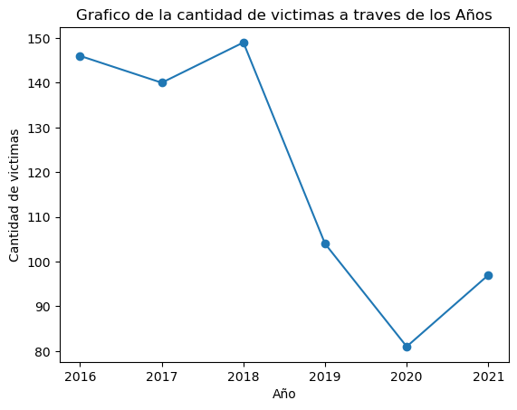

<h1 style="text-align:center">PROYECTO DE DATA ANALIST DE SINIESTRO VIALES EN CABA</h1>

Ciudad Autónoma de Buenos Aires (CABA), siendo una de las áreas urbanas más grandes de Argentina, enfrenta desafíos significativos relacionados con la seguridad vial debido a la alta densidad de tráfico. Este entorno urbano congestionado y dinámico puede contribuir a una incidencia considerable de accidentes de tránsito.

## Recopilación y Análisis de Datos

Las autoridades locales suelen llevar a cabo la recopilación y el análisis de datos relacionados con accidentes de tráfico. Estos esfuerzos buscan comprender las tendencias, identificar áreas problemáticas y desarrollar estrategias de prevención efectivas. La información recopilada proporciona una base para la toma de decisiones informada y la implementación de medidas destinadas a mejorar la seguridad vial.

## Impacto Social y Económico

Los accidentes de tránsito no solo representan una amenaza para la seguridad de los ciudadanos, sino que también tienen un impacto significativo en la sociedad y la economía en general. Entre las consecuencias se incluyen pérdidas humanas, lesiones, costos médicos, daños a la propiedad y congestión del tráfico. Estos aspectos subrayan la importancia de abordar la seguridad vial de manera integral.

## Proyecto de Análisis Exploratorio

Con el objetivo de abordar la problemática de los accidentes de tránsito, se lleva a cabo un proyecto que incluye:

1. **Análisis Exploratorio de Datos:**
   - Se explora la información proporcionada por el gobierno de CABA para comprender la naturaleza y las características de los accidentes.

2. **Limpieza de Datos y Transformaciones:**
   - Se realiza una limpieza de la información recopilada y se aplican transformaciones necesarias para obtener datos claros y valiosos.

3. **Extracción de Información Valiosa:**
   - Se extraen insights y patrones relevantes que pueden ser fundamentales para la formulación de estrategias de prevención.

4. **Recomendaciones para la Seguridad Vial:**
   - Se ofrecen recomendaciones basadas en los hallazgos del análisis exploratorio y la información extraída.

5. **Key Performance Indicators (KPI):**
   - Se presentarán KPI que permitirán evaluar el cumplimiento de los objetivos de seguridad vial a lo largo del tiempo.

Este enfoque integral busca no solo entender la problemática de los accidentes de tránsito en CABA, sino también proponer soluciones efectivas y medir el progreso a través de indicadores clave a lo largo de los años.

## Limpieza de datos y transformaciones

Los datos de víctimas fatales en CABA fueron extraídos de **https://data.buenosaires.gob.ar/dataset/victimas-siniestros-viales**, la cual nos proporciona información desde el año 2012 hasta el 2021, incluyendo datos sobre las víctimas, edad, fecha del accidente, género, etc.

Estos datos fueron procesados en el archivo **01-ETL.ipynb**. En primer lugar, se verificó la calidad de los datos, buscando valores incoherentes, duplicados y nulos.

Inicialmente, se identificó que había 696 registros en la página "Hechos" del archivo Excel extraído, mientras que en la página de "Víctimas" se tenían 717 registros. Algunos de estos valores faltantes estaban representados por "SD" y otros estaban en blanco.

Dado que los datos estaban en mayúsculas, se decidió convertirlos a minúsculas para una mayor consistencia y ademas cambiar el tipo de dato para los valores que sean numericos a enteros o decimales

Las páginas "Hechos" y "Víctimas" estaban relacionadas; uno, dos o tres registros de víctimas pertenecían a un hecho relacionado mediante un identificador (id). Se procedió a unirlos, y en la tabla de "Hechos" se tenía el número de víctimas, el cual se modificó a un valor igual a 1 al realizar esta operación de merge.

Durante esta combinación de registros, se identificaron registros con atributos que representaban la misma información. Se verificó que ambas fueran idénticas, pero se encontraron algunos registros que no lo eran. Al analizar más a fondo estos datos, se evidenció un registro incorrecto en el cual los datos pertenecientes a acusados estaban en "Víctimas" y viceversa. Se procedió a intercambiarlos y se verificó que dos registros estaban combinados debido a que ocurrió en este accidente con dos víctimas, por lo que se separaron para que cada víctima sea un registro independiente.

En los registros existían comunas con el valor 0, lo cual era peculiar ya que las comunas van del 1 al 15. Al analizar esto, se identificó que estos valores estaban presentes porque no se tenía la coordenada exacta del lugar y estos incidentes ocurrieron en autopistas, uniendo diferentes comunas. Por este motivo, no se podía asignar una comuna específica.

Las columnas de las horas en que ocurrieron los accidentes fatales presentaban valores nulos, y se procedió a rellenar estos valores mediante la mediana, ya que esta es la mejor representante para estos datos debido a su coeficiente de variabilidad superior al 50%. Este mismo proceso se llevó a cabo con la columna de edad de la víctima.

Adicionalmente, se añadieron columnas que ayudan a agrupar los datos, graficar y elaborar KPI. Se incluyó una columna "semestre", extraída del año en que ocurrió el accidente fatal, se creó la columna "dia_semana" que representa el nombre literal del día del accidente y, por último, la columna del "Rango etario", la cual agrupa las edades en diferentes categorías.

## Análisis Exploratorio de Datos

**1. Evolucion de los accidentes en los diferentes años**

  

    - Se puede evidenciar que se tiene informacion desde los años 2016 y 2021 sobre las victimas fatales. 
    - Entre el año 2016 y 2018 se puede ver cambios pequeños en la cantidad de victimas fatales. 
    - Para el año 2019 y 2020 existe una disminucion significativa en la cantidad de vistimas fatales con respecto a los años anteriores, esto puede deberse principalmente a que se entro a una pandemia y las personas no podian salir de sus casas 
    - En el año 2021 se puede ver un aumento significativo y esto puede deberse a que se debio permitir una disminucion de las restricciones de salida debido a los efectos de la pandemia  

**2. Distribucion de los accidentes ocurridos en cada mes**

  

- Los meses con mas accidentes fatales ocurren durante los meses segun el siguiente orden diciembre, noviembre, agosto y enero 
- Los meses con menos accidentes fatales son abril, julio y septiembre 
- Los motivos de que esos meses que ocurren mayores accidentes pueden ocurrir porque son meses mas comerciales    

**3. Accidentes que ocurren durante el dia de la semana**

  

- Los dias de la semana con mayor accidentes eon vistimas fatales son los dias sabado, domingo, y lunes 
- Al ser dia lunes un incio de semana existe una gran movilizacion de peatones y esta puede ser la razon de los accidentes 
- Los dias sabados y domingos son dias en los cuales la gente sale a fiestas, a pasear con la familia   

**4. Cantidad de ccidentes que ocurren en cada hora**

  

- Las horas con mayor cantidad de accidentes fatales ocurren en los siguientes horarios 5 a 9 de la mañana 
- Los horarios mas bajos de accidentes son de 0 a 4 de la madrugada 
- Tambien se ve que esta dividido en dos partes desde las 0 hasta las 13 pm y de las 14 hasta las 23 pm, sin embargo el mayor pico se encuentra en el medio de estos horarios en especial en el primer intervalo   

**5. Comuna y cantidad de accidentes**

  

- Las horas con mayor cantidad de accidentes fatales ocurren en los siguientes horarios 5 a 9 de la mañana 
- Los horarios mas bajos de accidentes son de 0 a 4 de la madrugada 
- Tambien se ve que esta dividido en dos partes desde las 0 hasta las 13 pm y de las 14 hasta las 23 pm, sin embargo el mayor pico se encuentra en el medio de estos horarios en especial en el primer intervalo   

**6. Tipo de calle y cantidad de accidentes**

  

- Donde ocurre mayor accidentes son en las avenidas de una forma significativa y una parte en las calles 
- Donde estan los menores son en las autopistas y general paz  

**7. Tipo de victima y cantidad de accidentes**

  

- Las victimas de estos accidentes fatales son en su mayoria motos, peatones y automoviles  
- Las motos y los peatones se puededn considerar mas propensos a morir en un accidente debido a que el impacto puede ser mas directo al cuerpo
  

**8. Acusado y cantidad de accidentes**

  

- En el grafico se puede ver que los acusados de el hecho en mayor medida son en el siguiente orden auto, pasajeros y cargas. 
- Se puede evidenciar una gran cantidad de pasajeros son acusados del accidente porque deben generar algun tipo de imprudencia.
  

**9. Genero y cantidad de accidentes**

  

- La mayor parte de las victimas fueron en gran medida del genero masculino con un 77% y el 23% son mujeres  

**10. Rango etario y cantidad de accidentes**

  

- El mayor numero de siniestros ocurrio en el rango etario de adulto, adulto de edad media, adulto mayor y ancianos. 
- Existe muy poca cantidad de victimas de infantes, niños y adolescentes  

## Recomendaciones para la Seguridad Vial

- Para los meses con mayor accidentes se deberia tomar medidas como incrementar el control vehícular con respecto a otros meses
- Incentivar al uso de cinturones para los conductores vehiculares, para las motos el uso de cascos y a los peatones darles mayor educacion vial
- Se recomeinda para estos dias con mayores accidetes fatales se debe aumentar el control vehicular
- Concientizar a usar los medios de seguridad vial a los conductores y mejorar la educacion vial en los ciudadanos
- Se debe aumentar el control en estos horarios con mayor pico e incentivar el uso de cascos y cinturones
- Se recomienda tener mayor reparticion de control vehicular en estas zonas de mayor cantidad 
- Se recomienda tener mayor reparticion de control vehicular en las avenidas de CABA
- Se recomienda tener mayor control en el uso de casco y velocidad a los usuarios de motocicleta ya que son los que tienen mas alta probabilidad de ser la victima
- Se recomienda dar una mayor educacion vial en los peatones ya que son la posicion dos en ser las victimas de los accidentes

- Mayor control en autos ya que son los que generan mayor accidentes
- Concientizar a los pasajeros para que no cometan actos que provoquen algun accidente
- Identificar aquellos factores claves por los cuales los pasajeros y conductores generan estos acciedntes ya que pueden ser por un mal mantenimiento vehicular o alguna distraccion y en los pasajeros puede ser por distraer al conductor u otra

- Dar mayor educacion vial al grupo mas alto de victimas fatales
- Sacar normas que disminuya la cantidad de conductores que tengan un rango etario de ancianos

## Key Performance Indicators (KPI)

Un Key Performance Indicator (KPI) es un indicador clave de rendimiento que proporciona información cuantificable sobre diversos aspectos del desempeño de una organización, un proceso o una actividad. Los KPIs diseñadas para medir el progreso hacia objetivos estratégicos y ayudar en la toma de decisiones informadas. Están vinculados directamente a los objetivos y metas de la entidad, proporcionando una medida clara y tangible del rendimiento.

Para este proyecto se realizo 3 diferentes KPI los cuales se presentan a continuacion.

### 1. Reducción del 10% en la tasa de homicidios en siniestros viales en CABA en comparación con el semestre anterior

En el archivo **03-KPI.ipynb**, se realizó la extracción de información sobre la población desde la página con la URL **https://www.estadisticaciudad.gob.ar/eyc/?p=29329.** Los datos venian en un archivo xls del cual se extrajeron los datos esenciales y se guardaron en formato CSV.

Estos datos de la poblacion de CABA son vitales para poder hallar primero la tasa de victimas fatales por cada cien mil habitantes 

Primero se agrupo los accidentes fatales por cada semestre del año para asi posteriormente usar la siguiente formula:

tasa=(nro_accidentes_semestre/poblacion)*100000

Una vez obtenido la tasa de cada semestre se procedio a comparar el incremento o decremento en la tasa de cada semestre del año

Variacion = ((tasa_actual - tasa_anterior)/tasa_anterior)*100

Por ultimo se realizo el siguiente grafico para ver en que momentos se logro con el objetivo y que semestre no se cumplio

  

En este grafico podemos observar que a traves del tiempo el objetivo de disminuir un 10% la tasa con respecto al semestre anterior solo fue cumplida durante 5 semestres los cuales son los años 2017-1, 2019-1, 2019-2, 2020-1 y 2021-2. Ademas se ve un pico demaciado alto en el semestre 2020-2 
Esto se puede deber al covid 19 y el confinamiento

### 2. Reducción del 7% en la cantidad de accidentes mortales de motociclistas en CABA en el último año en comparación con el año anterior

Para poder realizar este KPI primero se procedio a seleccionar solo los accidentes que las victimas estaban en motocicleta y posteriormente se procedio a agrupar la cantidad de victimas por cada año.

La formula utilizada para obtener el incremento o decremento de los accidentes es la siguiente:

Variacion = ((nro_vict_motos - nro_vict_motos_anterior)/nro_vict_motos_anterior)*100

Por ultimo se realizo el siguiente grafico para ver en que momentos se logro con el objetivo y que años no se cumplio 

  

- En el grafico se puede ver que el objetivo propuesto de reducir un 7% en los accidentes con con moto fueron cumplidos en los años 2017, 2019 y 2020
- El mayor año que s elogro una reduccion siginificativa fue durante el año 2020, si bine los otros años se redugieron estos se logro de forma dificil
- Un crecimiento de accidentes se puede ver en el año 2021 en el cual ocurrio un alto crecimeinto en la tasa de victimas en motos.

### 3. Reducción del 10% en la cantidad de accidentes mortales que ocurren en avenidas en CABA en comparacion con el año anterior

Para poder realizar este KPI primero se procedio a seleccionar solo los accidentes que las victimas ocurrieron en avenidas y posteriormente se procedio a agrupar la cantidad de victimas por cada año.

La formula utilizada para obtener el incremento o decremento de los accidentes en avenidas es la siguiente:

Variacion = ((nro_vict_avenidas - nro_vict_avenidas_anterior)/nro_vict_avenidas_anterior)*100

Por ultimo se realizo el siguiente grafico para ver en que momentos se logro con el objetivo y que años no se cumplio 

  

Se puede evidenciar que para los años 2017, 2019 y 2020 estos objetivo si se lograron cumplir por eso se considera una meta alcanzable para los proximos años 
Sin embargo, se puede notar un gran creciemiento en el año 2021 lo cual es un incremento muy alto y debe ser tratado las causas de este incremento